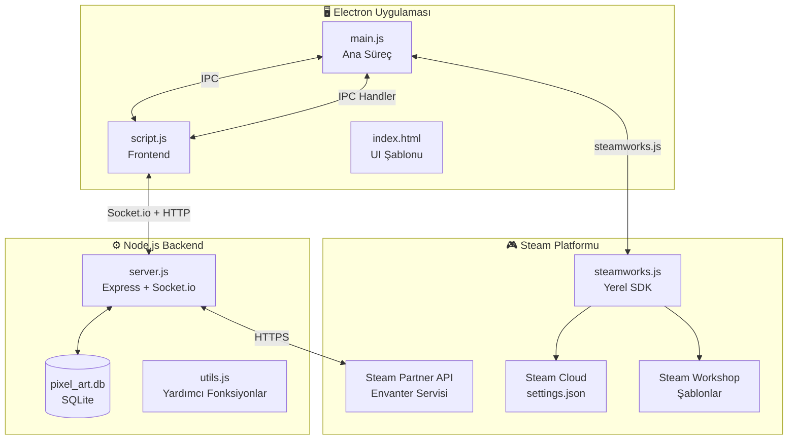

# 🏗️ Mimari

[[Giris|← Ana Sayfa]]

Pixelverse, **üç katmanlı** bir mimariye sahiptir.

---

## Genel Diyagram



---

## Katman 1: Electron Ana Süreç (`main.js`)

**Sorumluluklar:**
- Steam SDK'yı başlatma (`steamworks.init(4704280)`)
- Steam Rich Presence güncellemeleri
- Steam Cloud okuma/yazma (`settings.json`)
- Steam Workshop yükleme/listeleme
- Envanter eşya düşürme proxy'si
- Eşya tüketme (`ConsumeItem`) işlemleri
- Uzak sunucuya (`REMOTE_SERVER_URL`) bağlanma kararı

**Temel Değişkenler:**

| Değişken | Değer | Açıklama |
|----------|-------|----------|
| `APP_ID` | `4704280` | Steam uygulama ID'si |
| `REMOTE_SERVER_URL` | `https://pixelverse-online.onrender.com` | Üretim sunucusu |
| `steamUser` | `{ name, id, avatar }` | Oturum açmış kullanıcı |

**IPC Kanalları:**

| Kanal | Yön | Açıklama |
|-------|-----|----------|
| `update-presence` | Frontend → Main | Steam durumunu güncelle |
| `save-settings` | Frontend → Main | Cloud'a ayar kaydet |
| `load-settings` | Main → Frontend | Cloud'dan ayar yükle |
| `open-steam-market` | Frontend → Main | Steam market aç |
| `workshop-upload` | Frontend → Main | Atölye'ye yükle |
| `get-workshop-items` | Frontend → Main | Abone olunanları listele |
| `trigger-item-drop` | Frontend → Main | Steam'e eşya ver |
| `consume-item` | Frontend → Main | Steam'den eşya tüket |
| `get-inventory` | Frontend → Main | Steam envanterini çek |

---

## Katman 2: Node.js Backend (`server.js`)

**Sorumluluklar:**
- HTTP REST API (Express)
- Gerçek zamanlı iletişim (Socket.io)
- Piksel durumu yönetimi (`canvasState` Map)
- Haftalık sınırlı ganimet sistemi
- Böcek doğurma ve yönetme
- Steam API proxy endpoint'leri
- Haftalık anlık görüntü (snapshot) oluşturma

**Temel Sabitler (`server.js`):**

```js
const STEAM_WEB_API_KEY = '4B8CB3F7978F66CF39BD57FB05E15315';
const APP_ID = 4704280;
```

---

## Katman 3: Frontend (`script.js` + `index.html`)

**Sorumluluklar:**
- Canvas render döngüsü (`requestAnimationFrame`)
- Zoom/pan navigasyonu
- Palet yönetimi (standart + kilidaçık renkler)
- Nadir piksel efektleri (shimmer, blink — Altın/Gümüş/Elmas)
- Socket.io olaylarını dinleme ve tepki verme
- Envanter modal'ı, Atölye modal'ı
- Mini harita render

**UI Bileşenleri (`index.html`):**

| Element ID | Açıklama |
|-----------|----------|
| `#pixel-canvas` | Ana çizim tual'i |
| `#mini-map-canvas` | Küçük harita |
| `#palette-list` | Yatay renk paleti |
| `#activity-log` | Sol panel aktivite akışı |
| `#chat-messages` | Sağ panel sohbet |
| `#inventory-modal` | Hazineler modalı |
| `#workshop-modal` | Şablon yöneticisi |

---

## Dosya Yapısı

```
Oyun/
├── main.js              ← Electron ana süreç + Steam SDK
├── server.js            ← Express + Socket.io backend + Bug Leaderboard
├── script.js            ← Frontend mantığı + Canvas
├── utils.js             ← Paylaşılan sabitler (RARITY_CONFIG, GRID_DIMENSIONS)
├── index.html           ← UI şablonu
├── style.css            ← Stillendirme
├── steam_item_defs.json ← Steam eşya tanımları (38 eşya)
├── pixel_art.db         ← SQLite veritabanı (otomatik oluşturulur)
├── loot_history.json    ← Yerel düşürme geçmişi
├── assets/              ← Logo ve görseller
├── snapshots/           ← Haftalık PNG anlık görüntüler
├── items/               ← Atölye şablonları
└── tools/               ← Yardımcı scriptler
```
